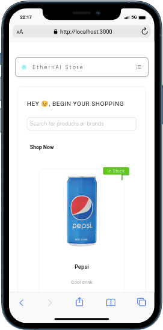
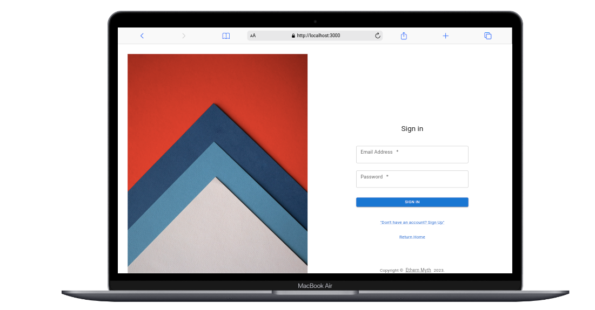

# Vite ReactJS with .NET CORE 7.0 AND PostgresSQL 15 - IN PROGRESS

Responsive Web App made to fit your needs **98% Error-Free Tested**. **Mobile App coming soon**

Quick Notes: 
    Changes have been made to the **vite.config.js** ,no need to change code unless necessary.

## BEGIN HERE:
### SCREENSHOTS


 .png)

.png).png)
 
.png)



.png)

**Technologies used**: 
    1. React JS
    2. Antd
    3. Mui (Material UI)
   
### INSTRUCTIONS

    1. Go to this repo and clone the repo for the backend.

        ```
            https://github.com/ethern-myth/certified-netcore
        ```

    2. Run the backend before starting the frontend

### INFORMATION

This App is an online shopping store. Cart services are already setup and working.

**Coming Soon**

- Dashboards (Clients and Admin)
- Payment Gateway
- Delivery service(Admin and Drivers)

**Keep in touch, more updates coming soon !!!**

